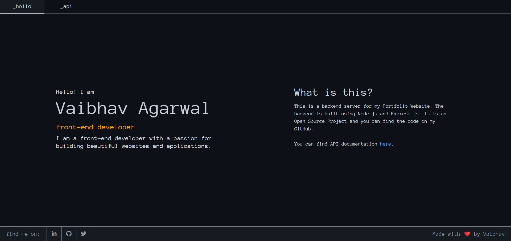

<a name="readme-top"></a>

[![MIT License][license-shield]](./LICENSE)
[![LinkedIn][linkedin-shield]](https://linkedin.com/in/vaibhava17)

<br />
<div align="center">
  <a href="https://vaibhava17-server.herokuapp.com/">
    
  </a>

  <h3 align="center">Vaibhav Portfolio Server</h3>

  <p align="center">
   A backend server for portfolio website.
   <br />With simple APIs for faster integration and developing.
    <br />
    <a href="https://github.com/vaibhava17/vaibhava17-server"><strong>Explore the docs »</strong></a>
    <br />
    <br />
    <a href="https://vaibhava17-server.herokuapp.com/">View Demo</a>
    ·
    <a href="https://github.com/vaibhava17/vaibhav17-server.github.io/issues">Report Bug</a>
  </p>
</div>


<details>
  <summary>Table of Contents</summary>
  <ol>
    <li>
      <a href="#about-the-project">About The Project</a>
      <ul>
        <li><a href="#built-with">Built With</a></li>
      </ul>
    </li>
    <li>
      <a href="#getting-started">Getting Started</a>
      <ul>
        <li><a href="#prerequisites">Prerequisites</a></li>
        </ul>
    </li>
    <li><a href="#usage">Usage</a></li>
    <li><a href="#contributing">Contributing</a></li>
    <li><a href="#license">License</a></li>
    <li><a href="#contact">Contact</a></li>
    <li><a href="#acknowledgments">Acknowledgments</a></li>
  </ol>
</details>


<!-- ABOUT THE PROJECT -->
## About The Project

[](https://vaibhava17-server.herokuapp.com/)

This is a fast and easy to use backend server. build using node js and express. If you're looking for a ready to use server for your amazing application you can use it. Do changes as you need.

Of course, no one will serve all projects since your needs may be different. So I'll be adding more in the near future. You may also suggest changes by forking this repo and creating a pull request or opening an issue. Thanks to all the people have contributed to expanding this server!

Use the `BLANK_README.md` to get started.

<p align="right">(<a href="#readme-top">back to top</a>)</p>


### Built With

* [Node JS](https://nodejs.org/en/)
* [Express](https://expressjs.com/)
* [Jwt](https://jwt.io/)
* [MongoDB](https://www.mongodb.com/)
* [Bootstrap](https://getbootstrap.com)


<p align="right">(<a href="#readme-top">back to top</a>)</p>


<!-- GETTING STARTED -->
## Getting Started

To get a local copy up and running follow these simple steps.

1. Clone the repo
   ```sh
   git clone https://github.com/vaibhava17/vaibhava17-server.github.io.git
   ```
2. Install NPM packages
   ```sh
   npm install
   ```
3. Create `.env` and Add
   ```env
    PORT=3030
    NODE_ENV=development
    MONGO_URI=your_mongodb_uri
    JWT_SECRET=123456
    SALT_ROUNDS=10
    OTP_CHARACTERS=abc123
    OTP_LENGTH=6
    API_URL="http://localhost:3030"

    <!-- For OTP authantication -->
    TWILIO_ACCOUNT_SID=your_twilio_account_sid
    TWILIO_AUTH_TOKEN=your_twilio_auth_token
    TWILIO_PHONE_NUMBER=your_twilio_phone_number

    <!-- For Deplyment on Heroku -->
    HEROKU_APP_NAME=your_heroku_app_name
    HEROKU_API_KEY=your_heroku_api_key
    HEROKU_EMAIL=your_heroku_email

    <!-- For github projects link -->
    GH_API_URL=https://api.github.com/repos
    ```
4. Run Server
    ```
    npm run dev
    ```
5. Open [http://localhost:3030](http://localhost:3030) with your browser to see the result.
6. You can also use the [API](https://vaibhava17-server.herokuapp.com/api-v1) to get the data.


### Prerequisites

This is an example of how to list things you need to use the software and how to install them.
* npm
  ```sh
  npm install npm@latest -g
  ```
* [Mongodb](https://www.mongodb.com/docs/v5.0/core/databases-and-collections/) Collection 
  
#### Some optional prerequisites
* [Twilio](https://www.twilio.com/docs/sms) Account
* [Heroku](https://devcenter.heroku.com/articles/getting-started-with-nodejs) Account

<p align="right">(<a href="#readme-top">back to top</a>)</p>

<!-- USAGE EXAMPLES -->
## Usage

* Portfolio Website
* Blog Website
* Gallery Website
* E-commerce Website & many more.

_For existing APIs Documentation, Follow this [link](https://vaibhava17-server.herokuapp.com/api-docs)_

<p align="right">(<a href="#readme-top">back to top</a>)</p>

<!-- CONTRIBUTING -->
## Contributing

Contributions are what make the open source community such an amazing place to learn, inspire, and create. Any contributions you make are **greatly appreciated**.

If you have a suggestion that would make this better, please fork the repo and create a pull request. You can also simply open an issue with the tag "enhancement".
Don't forget to give the project a star! Thanks again!

1. Fork the Project
2. Create your Feature Branch (`git checkout -b feature/AmazingFeature`)
3. Commit your Changes (`git commit -m 'Add some AmazingFeature'`)
4. Push to the Branch (`git push origin feature/AmazingFeature`)
5. Open a Pull Request


See the [open issues](https://github.com/vaibhava17/vaibhav17-server.github.io/issues) for a full list of proposed features (and known issues).


<p align="right">(<a href="#readme-top">back to top</a>)</p>

<!-- LICENSE -->
## License

Distributed under the MIT License. See [LICENSE](https://github.com/vaibhava17/vaibhav17-server.github.io/blob/master/LICENSE) for more information.

<p align="right">(<a href="#readme-top">back to top</a>)</p>

<!-- CONTACT -->
## Contact

<samp>
    <a href="https://twitter.com/_vaibhava__" target="_blank"></a> . 
    <a href="https://www.linkedin.com/in/vaibhava17/" target="_blank"></a> . 
    <a href="https://dev.to/vaibhava17" target="_blank"></a>
  </samp>

<p align="right">(<a href="#readme-top">back to top</a>)</p>

<!-- MARKDOWN LINKS & IMAGES -->
<!-- https://www.markdownguide.org/basic-syntax/#reference-style-links -->
[contributors-shield]: https://img.shields.io/github/contributors/vaibhav17/vaibhava17-server.github.io.svg?style=for-the-badge
[contributors-url]: https://github.com/vaibhava17/vaibhav17-server.github.io/graphs/contributors
[forks-shield]: https://img.shields.io/github/forks/vaibhava17/vaibhav17-server.github.io.svg?style=for-the-badge
[forks-url]: https://github.com/vaibhava17/vaibhav17-server.github.io/network/members
[stars-shield]: https://img.shields.io/github/stars/vaibhava17/vaibhav17-server.github.io.svg?style=for-the-badge
[stars-url]: https://github.com/vaibhava17/vaibhav17-server.github.io/stargazers
[issues-shield]: https://img.shields.io/github/issues/vaibhava17/vaibhav17-server.github.io.svg?style=for-the-badge
[issues-url]: https://github.com/vaibhava17/vaibhav17-server.github.io/issues
[license-shield]: https://img.shields.io/github/license/vaibhava17/vaibhav17-server.github.io.svg?style=for-the-badge
[linkedin-shield]: https://img.shields.io/badge/-LinkedIn-black.svg?style=for-the-badge&logo=linkedin&colorB=555
[linkedin-url]: https://linkedin.com/in/vaibhava17